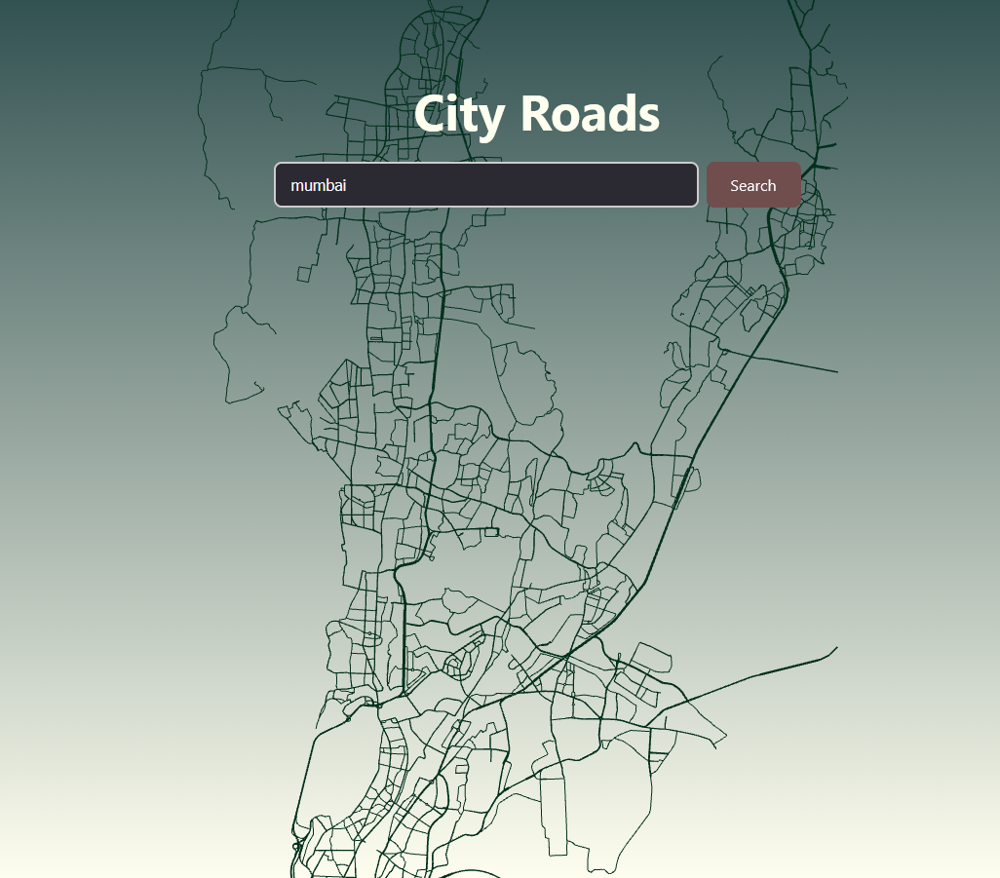

# City Roads

A web application that visualizes city road networks using OpenStreetMap data. Search for any city and watch its streets draw progressively on screen with WebGL rendering.



## Features

- **City Search** — Enter any city name to fetch and render its road network
- **Animated Drawing** — Roads render progressively for visual effect
- **Interactive Controls** — Zoom and pan to explore the map
- **Customization** — Adjust street color, background color, and line width
- **Export** — Download your creation as PNG or SVG

## Tech Stack


## Getting Started

### Prerequisites

- Node.js (v18+)
- npm or yarn

### Installation

```bash
git clone https://github.com/abhinavsingh1311/city-roads.git
cd city-roads
npm install
npm run dev
```

Open `http://localhost:5173` in your browser.

## Usage

1. Enter a city name in the search box
2. Click **Search** or press Enter
3. Watch the roads animate onto the screen
4. Use mouse wheel to zoom, drag to pan
5. Adjust colors and line width in the control panel
6. Export as PNG or SVG

## Project Structure

```
src/
├── components/
│   ├── CitySearch.jsx      # Main component
│   └── ControlPanel.jsx    # Settings panel
├── hooks/
│   └── useThreeScene.js    # Three.js setup & rendering
├── utils/
│   ├── nominatim.js        # Geocoding API
│   ├── overpass.js         # Road data API
│   └── projection.js       # Lat/lng to screen coords
└── App.jsx
```

## APIs Used

- [Nominatim](https://nominatim.openstreetmap.org/) — Geocoding (city name → bounding box)
- [Overpass](https://overpass-api.de/) — OpenStreetMap road data

## Acknowledgements

Inspired by [anvaka/city-roads](https://anvaka.github.io/city-roads/)

## License

MIT
